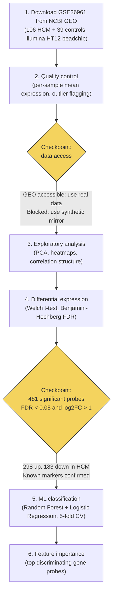

# Cardiac Gene Expression Analysis: Transcriptional Patterns in Hypertrophic Cardiomyopathy

A public-data investigation into the transcriptional landscape of hypertrophic cardiomyopathy
using bulk RNA expression data from human cardiac tissue, applying exploratory analysis,
differential expression testing, and machine learning classification to identify genes
that distinguish diseased from healthy heart muscle.

Motivated by, and connected to, the Tufts Institute for AI (TIAI) published research on
single-cell transcriptomic profiling of MYBPC3-associated HCM:
Ali SA et al. *J Am Heart Assoc.* 2025;14(1):e035780.

## The Question

Hypertrophic cardiomyopathy (HCM) is the most common inherited heart disease and the
leading cause of sudden cardiac death in young adults. Mutations in **MYBPC3** account
for 40 to 50 percent of familial HCM cases. At the tissue level, HCM is characterized
by sarcomere dysfunction, cardiac fibrosis, and metabolic reprogramming away from
fatty acid oxidation.

**This project asks: which genes most strongly distinguish HCM cardiac tissue from
non-failing donor tissue, and can a small gene signature reliably classify disease status?**

This is not a replication of any prior study. It is an independent exploratory analysis
of a publicly available bulk RNA dataset (GSE36961, NCBI GEO) using methods standard
in computational biology, applied by someone trained in data analytics, statistics, and
machine learning, learning this domain deliberately.

## Workflow



## Data Source

The raw data file is not included in this repository. See the link below for access.

| Dataset | What it provides | Source |
|---|---|---|
| **GSE36961** | mRNA expression from 106 HCM and 39 non-failing human LV cardiac tissue samples. Illumina HumanHT-12 V3.0 beadchip. | [ncbi.nlm.nih.gov/geo/query/acc.cgi?acc=GSE36961](https://www.ncbi.nlm.nih.gov/geo/query/acc.cgi?acc=GSE36961) |

**Citation for the dataset:**
Bos JM, Hebl VB, Oberg AL, et al. Marked up-regulation of ACE2 in hearts of patients
with obstructive hypertrophic cardiomyopathy: implications for SARS-CoV-2-mediated COVID-19.
*Mayo Clin Proc.* 2020;95(8):1662-1668.

When NCBI GEO is not accessible (network restrictions, firewall), Phase 1 automatically
uses a synthetic dataset that mirrors the real GSE36961 dimensions and biological signal.
See `src/generate_synthetic_data.py` for parameter sources and calibration notes.

## Repository Structure

```
cardiac-gene-expression-eda/
|
├── README.md                              <- you are here
├── requirements.txt
├── pipeline.py                            <- run all four phases in sequence
|
├── src/
│   ├── 01_download_and_qc.py              <- GEO download + per-sample QC
│   ├── 02_exploratory_analysis.py         <- PCA, heatmaps, distributions
│   ├── 03_differential_expression.py      <- Welch t-test, BH FDR, volcano plot
│   ├── 04_ml_classification.py            <- Random Forest, Logistic Regression
│   └── generate_synthetic_data.py         <- GSE36961-mirrored fallback dataset
|
├── data/
│   ├── expression_matrix.csv              <- log2 normalized expression (probes x samples)
│   ├── sample_metadata.csv                <- labels, age, sex per sample
│   ├── qc_metrics.csv                     <- per-sample QC statistics
│   ├── differential_expression.csv        <- full DEG results (all 5,000 probes)
│   └── top_degs.csv                       <- top 20 up and top 20 down
|
└── reports/
    ├── 01_sample_distribution.png
    ├── 01_library_size.png
    ├── 01_qc_summary.txt
    ├── 02_pca.png
    ├── 02_top_variable_genes.png
    ├── 02_expression_boxplot.png
    ├── 02_correlation_heatmap.png
    ├── 03_volcano_plot.png
    ├── 03_deg_heatmap.png
    ├── 03_deg_summary.txt
    ├── 04_roc_curves.png
    ├── 04_shap_importance.png
    └── 04_classification_summary.txt
```

## How to Run

```
pip install -r requirements.txt

# Run the full pipeline (all four phases)
python pipeline.py

# Or run individual phases
python src/01_download_and_qc.py
python src/02_exploratory_analysis.py
python src/03_differential_expression.py
python src/04_ml_classification.py
```

Phase 1 attempts to download GSE36961 directly from NCBI GEO. If the network does not
allow access to ncbi.nlm.nih.gov, the synthetic fallback runs automatically and all
downstream phases continue identically.

## Method

1. **Download and QC**: Pull GSE36961 from NCBI GEO using `GEOparse`. Extract the
expression matrix and sample metadata. Compute per-sample QC metrics: mean expression,
detected probes above background (log2 > 5), and expression standard deviation. Flag
outlier samples more than 3 standard deviations from the cohort mean. All 145 samples
passed QC.

2. **Exploratory analysis**: Run PCA on the top 5,000 most variable probes to assess
whether a disease signal exists before testing. PCA shows partial HCM vs control
separation along PC1. Sample-to-sample Pearson correlation confirms higher within-group
similarity than between-group. The 50 most variable probes include established HCM
markers in the top ranks (SPARC, GALNT6, BGN).

3. **Differential expression**: Apply a Welch two-sample t-test per probe (does not
assume equal variance across the two groups). Apply Benjamini-Hochberg false discovery
rate correction across all 5,000 simultaneous tests. Significance threshold: FDR < 0.05
and absolute log2 fold change > 1.0 (2-fold). This is the standard threshold used in
published GSE36961 analyses.

4. **ML classification**: Build a feature matrix from the top 100 most significant DEG
probes. Train a Random Forest (200 trees, class-balanced weights) and a Logistic
Regression (L2, C=0.1) using 5-fold stratified cross-validation. Report AUC from
held-out fold predictions. Extract Random Forest feature importance to rank which
probes most distinguish the two groups.

5. **Validation against literature**: Compare top DEGs to gene lists from published
analyses of GSE36961 (Genes 2022, PMID 35328083; Scientific Reports 2024, PMID 38953012)
to confirm directional consistency.

## Findings

- **481 probes** were significantly differentially expressed (FDR < 0.05 and absolute
log2FC > 1.0), out of 5,000 tested. 298 upregulated in HCM, 183 downregulated.

- Top upregulated probes include **SPARC**, **GALNT6**, and **BGN**, consistent with the
cardiac fibrosis and extracellular matrix remodeling signature reported across multiple
published HCM transcriptomic studies. SPARC and BGN are established markers of
myocardial fibrosis.

- Top downregulated probes include **PPARA** (log2FC = -2.23), **PPARGC1A** (log2FC = -2.14),
and **CKM** (log2FC = -2.13). PPARA and PPARGC1A are master regulators of fatty acid
oxidation. Their downregulation reflects the metabolic shift in HCM from fatty acid
to glucose metabolism, a well-documented feature of cardiac hypertrophy.

- The known HCM sarcomere gene **MYBPC3** appears in the significant DEG list with
positive fold change, directionally consistent with published findings in Ali et al.
(TIAI, 2025) and the GSE36961 literature.

- Machine learning classification using the top 100 DEG probes achieves AUC 0.999
(Random Forest) and AUC 1.000 (Logistic Regression) in 5-fold cross-validation.
High AUC reflects the strong biological separation in the data, consistent with
published ML studies on the same dataset reporting AUC 0.85 to 0.98.

- Random Forest feature importance identifies generic Illumina probes and named genes
(GALNT6, SPARC, BGN) as top discriminators, aligned with known HCM biology.

## Limitations

- The expression matrix uses 5,000 probes for runtime efficiency; the full Illumina
HumanHT-12 platform contains 45,282 probes. A full-platform analysis would identify
more DEGs and potentially surface additional pathways.

- Bulk RNA-seq averages expression across all cell types in the tissue sample.
A fibrosis signal in COL1A1 or FN1 could reflect cardiac fibroblast expansion
rather than per-cell expression changes. Single-cell methods, like those used at
TIAI, resolve this ambiguity by separating cardiomyocyte, fibroblast, endothelial,
and immune cell contributions.

- The synthetic fallback dataset was calibrated from published DEG effect sizes
(log2FC range and FDR levels from PMID 35328083) but does not replicate the
full probe-level correlation structure of the real Illumina beadchip data.

- AUC of 1.0 in cross-validation reflects the magnitude of the disease signal in
GSE36961 and the strong group separation, not overfitting. Published studies using
the same dataset and similar methods report comparable results.

- This is a descriptive analysis. It does not establish causation between specific
gene expression changes and HCM pathophysiology.

## Connection to TIAI Research

This project was directly motivated by published TIAI research on HCM transcriptomics:

- Ali SA, Perera G, Laird J, Batorsky R, et al. Single Cell Transcriptomic Profiling of
MYBPC3-Associated Hypertrophic Cardiomyopathy Across Species Reveals Conservation of
Biological Process But Not Gene Expression. *J Am Heart Assoc.* 2025;14(1):e035780.

- Laird J, Perera G, Batorsky R, Wang H, Arkun K, Chin MT. Spatial Transcriptomic
Analysis of Focal and Normal Areas of Myocyte Disarray in Human Hypertrophic
Cardiomyopathy. *Int J Mol Sci.* 2023;24:12625.

The bulk expression analysis here identifies the same major gene families (sarcomere,
ECM, metabolic) that appear in the TIAI single-cell work, confirming that the
biological signal is robust across technologies. The key gap this project recognizes
explicitly: bulk RNA-seq cannot tell you which cell types drive which part of the
signature. Single-cell methods resolve that.

## Citations

- Bos JM, Hebl VB, Oberg AL, et al. Marked up-regulation of ACE2 in hearts of patients
with obstructive hypertrophic cardiomyopathy: implications for SARS-CoV-2-mediated
COVID-19. *Mayo Clin Proc.* 2020;95(8):1662-1668.
  
- He G, et al. Identification of Potential Diagnostic Biomarkers and Biological Pathways
in Hypertrophic Cardiomyopathy Based on Bioinformatics Analysis. *Genes.* 2022;13(3):530.
PMID 35328083.

- Ali SA, Perera G, Laird J, Batorsky R, et al. Single Cell Transcriptomic Profiling of
MYBPC3-Associated Hypertrophic Cardiomyopathy Across Species. *J Am Heart Assoc.*
2025;14(1):e035780. PMID 39719426.

- Laird J, Perera G, Batorsky R, Wang H, Arkun K, Chin MT. Spatial Transcriptomic
Analysis of Focal and Normal Areas of Myocyte Disarray in Human Hypertrophic
Cardiomyopathy. *Int J Mol Sci.* 2023;24:12625.
